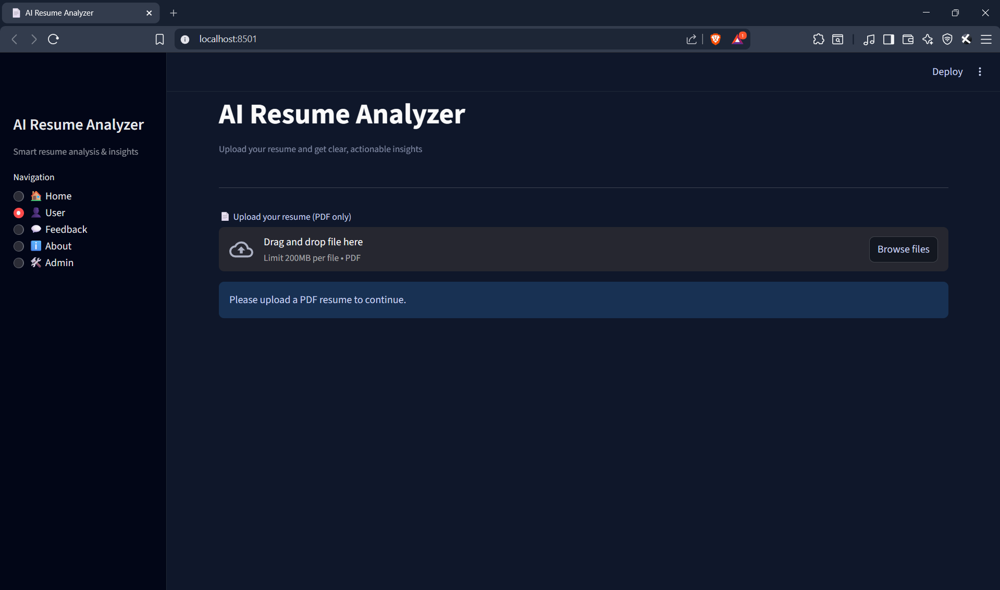
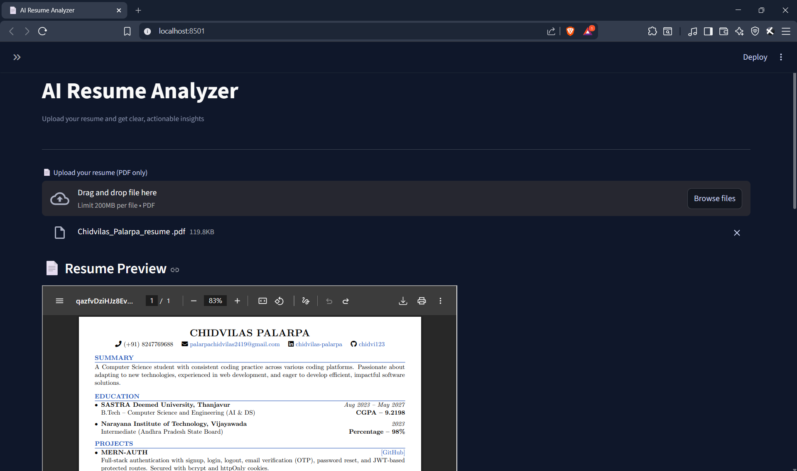
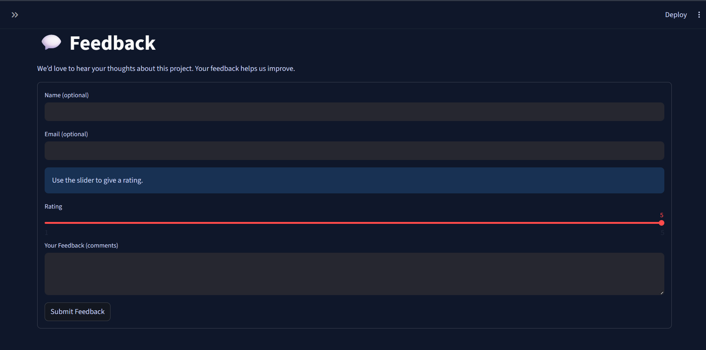

<h1 align="center">
AI Resume Analyzer using NLP & Semantic Similarity
</h1>

<p align="center">

An intelligent Streamlit-based web application that analyzes resumes using Natural Language Processing (NLP), semantic similarity, and rule-based evaluation techniques to provide resume scoring, skill gap analysis, job-role matching, and personalized career recommendations.

</p>

<p align="center">


</p>

---

# Overview

AI Resume Analyzer is a modular resume analysis platform designed to help students and job seekers evaluate their resumes against industry expectations.

The system automatically extracts resume content from PDF files, identifies technical skills, estimates experience level, evaluates resume quality, measures semantic similarity with target job roles, and recommends improvements based on missing skills.

Unlike traditional keyword matching systems, this project utilizes Sentence Transformers to perform semantic comparison between resumes and predefined job role descriptions, enabling more meaningful and context-aware matching.

The application also includes administrative analytics for resume insights, clustering, similarity search, and user feedback management through MongoDB.

---

# Features

## User Features

- Upload resumes in PDF format
- Automatic resume text extraction
- Resume parsing and structured information extraction
- Resume quality scoring with detailed score breakdown
- Experience level prediction
- Skill extraction and normalization
- Target job role selection
- Semantic Job Match Score using Sentence Transformers
- Skill Gap Analysis
- Recommended technical courses
- Resume building resources
- Interview preparation resources
- Resume similarity analysis
- Duplicate resume detection
- Resume analytics storage
- Modern responsive Streamlit interface

---

## Admin Features

- Secure Admin Login
- Resume Analytics Dashboard
- Resume Similarity Search
- Resume Clustering using K-Means
- Skill Distribution Analysis
- Resume Score Distribution
- Missing Skill Analytics
- Download Analytics Reports
- User Feedback Monitoring

---

# Key Highlights

- NLP-powered Resume Analysis
- Semantic Similarity Matching
- Explainable Resume Score
- Skill Gap Detection
- Role-Based Recommendations
- Resume Clustering
- MongoDB Integration
- Modular Project Architecture
- Interactive Streamlit Dashboard

---

# Technology Stack

| Category | Technologies |
|-----------|--------------|
| Language | Python 3.11 |
| Frontend | Streamlit |
| NLP | Sentence Transformers (all-MiniLM-L6-v2) |
| Machine Learning | Scikit-learn |
| Semantic Matching | Cosine Similarity |
| Resume Parsing | PDFMiner |
| Data Processing | Pandas, NumPy |
| Database | MongoDB |
| Visualization | Plotly, Matplotlib |
| Version Control | Git & GitHub |

---

# System Architecture

The project follows a modular architecture to ensure maintainability, scalability, and separation of responsibilities.

```
User
   │
   ▼
Streamlit Frontend
   │
   ▼
Resume Upload (PDF)
   │
   ▼
PDF Text Extraction
   │
   ▼
Resume Parsing
   │
   ▼
Skill Extraction
   │
   ▼
Resume Scoring
   │
   ▼
Experience Detection
   │
   ▼
Semantic Job Matching
   │
   ▼
Skill Gap Analysis
   │
   ▼
Recommendations
   │
   ▼
MongoDB Storage & Analytics
```

---

# Core Modules

### Resume Parsing

Extracts textual content from uploaded PDF resumes and converts them into structured information.

---

### Resume Scoring

Evaluates resumes using explainable rule-based criteria including sections, skills, projects, education, certifications, and resume completeness.

---

### Experience Detection

Automatically estimates candidate experience level based on extracted resume content.

---

### Skill Extraction

Extracts technical skills from resumes using normalization dictionaries and predefined aliases.

---

### Semantic Job Matching

Uses Sentence Transformers to compare resume embeddings with job-role embeddings and computes a Job Match Score using cosine similarity.

---

### Skill Gap Analysis

Compares candidate skills with role-specific requirements and highlights missing skills required for the selected job role.

---

### Learning Recommendations

Provides curated courses, certifications, interview preparation videos, and resume improvement resources.

---

### Admin Analytics

Stores resume analytics in MongoDB for visualization, clustering, and long-term insights.

## Project Structure

```text
AI_Resume_Analyzer/
│
├── app/
│   ├── main.py
│   └── views/
│       ├── home.py
│       ├── user.py
│       ├── admin.py
│       ├── feedback.py
│       ├── about.py
│       └── JobDescription.py
│
├── backend/
│   ├── analysis/
│   ├── database/
│   ├── nlp/
│   ├── parser/
│   ├── recommender/
│   └── utils/
│
├── data/
│   ├── courses.json
│   └── skills.json
│
├── docs/
│   └── screenshots/
│
├── Uploaded_Resumes/
├── requirements.txt
├── README.md
└── .gitignore
```

---

# Installation Guide

## Prerequisites

Before running the project, ensure you have:

* Python 3.11 (Recommended)
* Git
* pip
* Internet connection (required for downloading NLP models during the first run)

---

## Clone Repository

```bash
git clone https://github.com/Sarah06399/AI_Resume_Analyzer.git
cd AI_Resume_Analyzer
```

---

## Create Virtual Environment

Windows

```bash
python -m venv venv
venv\Scripts\activate
```

Linux / macOS

```bash
python3 -m venv venv
source venv/bin/activate
```

---

## Install Dependencies

```bash
pip install -r requirements.txt
```

---

## Run Application

```bash
streamlit run app/main.py
```

After successful execution, the application will be available at:

```
http://localhost:8501
```

---

# Working Pipeline

The application follows the workflow below:

```
Upload Resume
      │
      ▼
PDF Text Extraction
      │
      ▼
Resume Parsing
      │
      ▼
Skill Extraction
      │
      ▼
Experience Detection
      │
      ▼
Resume Score Calculation
      │
      ▼
Target Role Selection
      │
      ▼
Semantic Job Matching
      │
      ▼
Skill Gap Analysis
      │
      ▼
Recommendations
      │
      ▼
Analytics Storage (MongoDB)
```

---

# Resume Analysis Workflow

Once a resume is uploaded, the application performs the following tasks automatically:

* Extracts text from the uploaded PDF.
* Parses resume content into structured information.
* Detects technical skills.
* Estimates experience level.
* Computes a Resume Score.
* Displays a detailed score breakdown.
* Allows users to select a target job role.
* Computes semantic similarity between the resume and target role.
* Calculates a Job Match Score.
* Identifies missing skills.
* Recommends courses and certifications.
* Suggests interview preparation resources.
* Stores analytics for administrative insights (if MongoDB is configured).

---

# Machine Learning & NLP Techniques Used

The project integrates several AI and NLP techniques:

### Sentence Transformers

Generates dense semantic embeddings for resumes and job-role descriptions.

### Cosine Similarity

Measures semantic similarity between resume embeddings and target role embeddings.

### Skill Extraction

Dictionary-based extraction combined with normalization and alias mapping.

### Resume Scoring

Explainable rule-based scoring instead of a black-box model, providing transparency in evaluation.

### Resume Clustering

Uses K-Means clustering to group resumes with similar characteristics for administrative analysis.

---

# Database Design

MongoDB is used for persistent storage.

The system maintains separate collections for:

* Resume Information
* Analytics Records
* Feedback
* Contact Messages

Resume records are deduplicated using semantic hashing, while analytics are stored as event-based records to support historical analysis without data duplication.

---

# Current Project Status

✅ Resume Parsing

✅ Resume Score Generation

✅ Experience Detection

✅ Skill Extraction

✅ Semantic Job Matching

✅ Skill Gap Analysis

✅ Course Recommendation

✅ Interview Resources

✅ Resume Similarity Search

✅ Resume Clustering

✅ MongoDB Analytics

✅ Admin Dashboard

✅ Responsive Streamlit UI

---

# Future Enhancements

* ATS Compatibility Score
* Resume vs Job Description Comparison
* AI-powered Resume Improvement Suggestions
* Automatic Resume Rewriting
* Cover Letter Generation
* Cloud Deployment with MongoDB Atlas
* User Authentication
* Email-based Report Generation
* Downloadable Resume Analysis Report (PDF)
* Dashboard Analytics using Power BI or Tableau

---

# Notes

* Python 3.11 is recommended for compatibility with the NLP libraries.
* MongoDB is required only for Feedback, Contact, Analytics, and Admin modules.
* Core Resume Analysis features work independently.
* The first execution may take additional time because Sentence Transformers downloads the pretrained embedding model automatically.

# Preview

---

## Home Page

<p align="center">
  
  
</p>

---

## User Dashboard

<p align="center">
  
  
</p>

---


# Admin Dashboard

## Admin Login

<p align="center">
  
  
</p>

---

## Feedback Page

<p align="center">
  
</p>

---

## Contact Page

<p align="center">
  
</p>

---

# Applications

This project can be used for:

* Resume Evaluation
* Campus Placement Assistance
* Career Guidance Platforms
* Skill Gap Identification
* Resume Screening
* Educational Institutions
* Recruitment Support Systems
* Personal Resume Improvement

---

# Why This Project?

This project demonstrates the practical application of Natural Language Processing and Machine Learning in solving a real-world recruitment problem.

Unlike simple keyword-based resume checkers, the application performs semantic comparison using Sentence Transformers to better understand resume content and compare it with target job roles.

The modular architecture also makes it easy to extend with additional AI capabilities such as ATS scoring, LLM-powered resume feedback, resume rewriting, and job description matching.

---

# Conclusion

AI Resume Analyzer is an end-to-end resume intelligence platform that combines NLP, semantic similarity, explainable resume scoring, and career guidance into a single interactive application.

The project demonstrates:

* Natural Language Processing
* Semantic Search
* Resume Intelligence
* Information Extraction
* Skill Gap Analysis
* Explainable Analytics
* Database Integration
* Modular Software Architecture

It provides a practical example of how AI can be used to assist students and job seekers in improving their employability while also offering administrators meaningful analytics for decision-making.

---

# Author

Sharwari Raut

Computer Science Engineering Student

Interested in:

* Artificial Intelligence
* Machine Learning
* Natural Language Processing
* Software Development
* Data Structures & Algorithms

GitHub:

```text
https://github.com/Sarah06399
```

LinkedIn:

```text
https://www.linkedin.com/in/sharwari-raut-b17816338/
```

---

# License

This project is intended for educational, learning, and portfolio purposes.

Feel free to fork the repository, suggest improvements, or build additional features on top of it while providing appropriate attribution where applicable.

---

# Contributions

Contributions, feature requests, and bug reports are welcome.

If you would like to improve the project:

1. Fork the repository.
2. Create a new feature branch.
3. Commit your changes.
4. Open a Pull Request.

---

# Acknowledgements

Special thanks to the open-source community and the developers of:

* Streamlit
* Sentence Transformers
* Hugging Face
* Scikit-learn
* MongoDB
* PDFMiner

whose tools and libraries made this project possible.

---

<p align="center">

⭐ If you found this project useful, consider giving it a star on GitHub!

</p>
